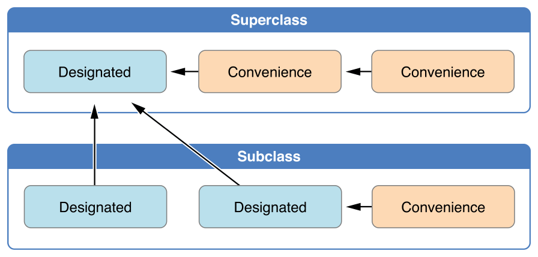

[TOC]


# Initialization (初始化)

Swift中初始化器和反初始化器的概念，可以和其他开发语言中的构造函数和析构函数进行对应。


## 初始化器的定义

枚举，结构体和类都可以定义初始化器。

**类**可以定义两种初始化器：**指定初始化器**(designated initializer) 和 **便捷初始化器**(convenience initializer)。

**指定初始化器**

```pseudocode
init(parameters) {
    statements
}
```

**便捷初始化器**

```pseudocode
convenience init(parameters) {
    statements
}
```


## 初始化器的规则

具体的规则说明和图示，也可查阅官方文档：[Class Inheritance and Initialization](https://docs.swift.org/swift-book/LanguageGuide/Initialization.html#ID216)。

**初始化器的设计原则：**

1. 每个类至少有一个指定初始化器，指定初始化器是类的主要初始化器。
2. 默认初始化器总是类的指定初始化器。
3. 类偏向于拥有少量的指定初始化器，通常情况下，一个类只需要一个指定初始化器就可以了。

**初始化器的相互调用规则：**

1. 指定初始化器必须从它的直系父类调用指定初始化器。
2. 便捷初始化器必须从相同的类中调用另外一个初始化器，并且便捷初始化器最终必须要能够调用到一个指定初始化器。

*这一套规则保证了，使用任何一个初始化器，都可以完整地初始化实例。*

相互调用规则图示如下：

两层继承：



更多层继承：


**两段式初始化：**

1. 第一阶段，初始化所有存储属性。
   - 外层调用指定/便捷初始化器。
   - 分配内存给实例，但是此时尚未初始化。
   - 指定初始化器确保当前类定义的存储属性都初始化。
   - 指定初始化器调用父类的初始化器，不断向上调用，形成初始化器链。
2. 第二阶段，设置新的存储属性值。
   - 从顶部初始化器往下，链中的每一个初始化器都有机会进一步定制实例。
   - 初始化器此时可以使用`self`，访问属性，实例方法等。
   - 最终，链中的任何便捷初始化器都有机会定制实例以及使用`self`。

**安全检查：**

1. 指定初始化器必须保证在调用父类的指定初始化器之前，当前类中的所有存储属性都要初始化完成。
2. 指定初始化器必须先调用父类的初始化器，然后才能为继承的属性设置新值。
3. 便捷初始化器必须先调用同类中的其它初始化器，然后才能为任意属性设置新值。
4. 初始化器在第一阶段初始化完成之前，不能访问实例属性，方法等，也不能引用`self`。
5. 直到第一阶段结束，实例才算是合法的实例。


## 初始化器的重写

和方法的重写一样，如果子类重写父类的指定初始化器，不管是重写成指定初始化器还是便捷初始化器，都必须加上override关键字。

如果是便捷初始化器，严格来说没有重写一说，所以如果子类写了一个匹配父类便捷初始化器的初始化器，不用加上override关键字。

*关于重写，请参考 继承 章节。*


## 初始化器的自动继承

1. 如果子类没有定义任何指定初始化器，那么它会自动继承父类的所有指定初始化器。
2. 如果子类提供了父类的所有指定初始化器的实现(*要么按照方式1自动继承，要么重写所有的指定初始化器，或者重写部分指定为便捷*)，那么子类自动继承父类的所有便捷初始化器。


## required

用required关键字修饰指定初始化器，表明所有子类都必须实现该初始化器(*通过自动继承或者重写实现*，只不过子类重写的话，只需要写上required就可以了，不用再写override)。

```swift
class Person {
    var age: Int
    
    required init() {
        age = 0
    }
    
    init(age: Int) {
        self.age = age
    }
}

class Student: Person {
    var score: Int
    required init() {
        self.score = 0
        super.init()
    }
}
```


## 可失败初始化器 (`init?` / `init!`)

init? / init!，故名思义：init?初始化出来的实例是可选项(*关于可选项，请参考可选项章节*)，而init!初始化出来的实例会进行隐式解包。

关于可失败初始化器，有以下规则：

1. 可以完全进行匹配的可失败初始化器和非可失败初始化器不构成重载。
2. 可失败初始化器和非可失败初始化器可以进行相互调用，但是非可失败初始化器调用可失败初始化器需要进行解包操作。
3. 如果初始化器调用一个可失败初始化器导致初始化失败，那么整个初始化过程都失败，且之后的代码也不会执行。
4. 可以用一个非可失败初始化器重写一个可失败初始化器，但是反之则不行。


## 反初始化器(deinit)

当类的实例对象释放内存时，就会调用实例对象的deinit方法，调用顺序是先子类后父类。

deinit写法固定`deinit { ... }`，**不能设置参数，不能写小括号，不能自行调用**。

```swift
class Car {
    deinit {
        print("Car deinit")
    }
}

class BMW: Car {
    deinit {
        print("BMW deinit")
    }
}

do {
    BMW()
}

//BMW deinit
//Car deinit
```

BMW()是一个局部变量，释放的时候会先调用类BMW的反初始化器，然后再调用其父类的反初始化器。