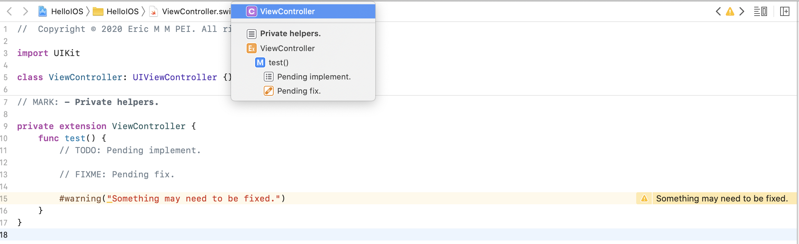

[TOC]


# 从 Objective-C 到 Swift


## 编译标记

编译标记也相当于给代码做了注释或者分段。

```swift
// MARK: Some text 类似于 Objective-C中的 #pragma Some text
// MARK: - Some text 类似于 Objective-C中的 #pragma - Some text
// TODO: Someting pending implement.
// FIXME: Something pending fix.
#warning("Something may need to be fixed.")
```

可以在Xcode的编辑区域去试一下上边编译标记的用法，然后点击编辑区域的顶端，标记会显示在展开的列表中：




## 条件编译

Swift中的条件编译相对Objective-C来说已经弱化了，只保留了：

```swift
#if <compilation condition 1>
statements to compile if compilation condition 1 is true
#elseif <compilation condition 2>
statements to compile if compilation condition 2 is true
#else
statements to compile if both compilation conditions are false
#endif
```

而 `<compilation condition>` 也有3种情况：

1. 布尔型字面量 `true/false`。

   ```swift
   #if true
   print("123")
   #endif
   ```

2. 在 `BuildSettings -> Other Swift Flags` 里边通过 `-D xxx` (i.e. `-D DEBUG`) 添加的flag。

   ```swift
   #if DEBUG
   func debugFunction() {
       print("Debug mode.")
   }
   #else
   func debugFunction() {
       print("Release mode.")
   }
   #endif
   ```

3. 下表中系统定义的平台相关的条件表达式。

   |  Platform condition   |              Valid arguments               |
   | :-------------------: | :----------------------------------------: |
   |        `os()`         | `macOS`, `iOS`, `watchOS`, `tvOS`, `Linux` |
   |       `arch()`        |      `i386`, `x86_64`, `arm`, `arm64`      |
   |       `swift()`       |  `>=` or `<` followed by a version number  |
   |     `compiler()`      |  `>=` or `<` followed by a version number  |
   |     `canImport()`     |               A module name                |
   | `targetEnvironment()` |         `simulator`, `macCatalyst`         |

> 注意
>
> 更多详情请阅读官方文档 [Compiler Control Statements](https://docs.swift.org/swift-book/ReferenceManual/Statements.html#ID538).


## 日志打印 (printLog)

在Swift中，已经不能像Objective-C那样去控制日志输出了 (`#define NSLog(...) while(0){}`)，一方面也是因为Swift中的宏定义被弱化了。

Swift中日志打印，请查看 [函数 print函数在实际开发中的使用](../语法/Functions%20(函数).md#print函数在实际开发中的使用)。


## 系统版本检测

开发中，可能会判断某些代码只在特定的iOS版本上才会被执行，或者某些系统的API对iOS版本有要求，也必须添加系统检测判断。

```swift
if #available(iOS 14.0, *) {
    print("iOS 14.0 and higher.")
} else {
    print("Less than iOS 14.0")
}
```


## API可用性

有时候需要限定一些API的可用性，比如，只能在iOS14及以上才允许被使用，或者标记为已经过时或者被废弃掉的API 等，这个时候就会使用到API可用性的标记，更多细节请阅读官方文档：https://docs.swift.org/swift-book/ReferenceManual/Attributes.html

```swift
@available(iOS 14, macOS 10.15, *)
struct Person {
    @available(*, unavailable, renamed: "run")
    func run_() {}
    func run() {}
    
    @available(iOS, deprecated: 13.1)
    func eat() {}
}
```

上边的代码：

- `Person`要被使用的话，必须加上系统版本检测才行，否则报错。
- `run_`方法已经被更名了，如果强行使用的话，也会报错。
- `eat`方法已经过时了，如果使用的话，系统会抛出警告，但是该方法仍然可以被使用，不过开发中，尽量不要使用已经过时的方法，因为：
  - 有些代码标准中是不允许有警告的。
  - 既然被标记了过时，那就表明，该API可能存在问题，迟早要被废弃掉，那还不如早早做应对。


## iOS程序的入口

在C语言的世界里，程序的入口就是一个main函数，不过在Swift命令行项目里，已经没有main函数这个概念了，只有一个main.swift的文件，直接可以在该文件中书写代码，效果就像相当于整个文件的作用域就是一个main函数。

Swift iOS项目中，默认的程序的入口是AppDelegate，那是因为AppDelegate有一个修饰 `@UIApplicationMain`。

在Objective-C iOS项目中，是没有 `@UIApplicationMain` 这个标记的，因为它本身就有一个main函数：

```objective-c
int main(int argc, char * argv[]) {
    NSString * appDelegateClassName;
    @autoreleasepool {
        // Setup code that might create autoreleased objects goes here.
        appDelegateClassName = NSStringFromClass([AppDelegate class]);
    }
    return UIApplicationMain(argc, argv, nil, appDelegateClassName);
}
```

那么，在Swift iOS项目中，我们也可以做同样的改变：

1. 删除 `@UIApplicationMain` 的标记。

2. 创建一个`main.swift`的文件，然后添加代码：

   ```swift
   class MyApplication: UIApplication {}
   
   UIApplicationMain(CommandLine.argc,
                     CommandLine.unsafeArgv,
                     NSStringFromClass(MyApplication.self),
                     NSStringFromClass(AppDelegate.self))
   ```

   这样我们就可以自定义一些东西了：

   - 重新命名AppDelegate。

   - 自定义UIApplication，比如创建一个新的UIApplication类，并重写里边的方法：

     ```swift
     class MyApplication: UIApplication {
         override func sendEvent(_ event: UIEvent) {
             super.sendEvent(event)
             
             print(event)
         }
     }
     ```

     重写sendEvent方法，这样我们就可以监听应用程序里所有的点击时间了。

> 思考
>
> 开发中，如果没有非常特殊的需求的话，大可不必这样做，就把AppDelegate当成程序的入口就可以了。


## Swift 和 Objective-C进行相互调用

[示例代码: Etiquette](../../Source/C+Objective-C+Swift/Etiquette)

在章节 [C+Objective-C+Swift混编](C+Objective-C+Swift混编.md) 中，已经介绍过如何进行混编以及关于混编的一些特点和思考，接下来，我们看看代码层面，两种语言相互调用的一些注意点。

### Swift调用C语言 之 `@_silgen_name({new name}) func xxx`

C语言在Swift中调用的话，就相当于调用Swift的全局函数，如果有一种情况：

C语言转换成Swift的函数 和 Swift某个已经存在的函数相同(*函数名，参数，返回值 均一致*)，那么，就会调用Swift中定义的函数，如果我们这个时候还是想调用到C语言的函数，怎么办呢？

答案：**可以使用`@_silgen_name` 给C语言的函数改一个新名字。**

比如 (注意C语言中的int类型代表4个字节，对应Swift中的Int32。)：

```swift
// Rename the C function "sum" defined in the file CVendor.c as "swiftSum".
@_silgen_name("sum") func swiftSum(_ v1: Int32, _ v2: Int32) -> Int32
```

### Objective-C调用Swift

有以下注意点：

- Swift暴露给Objective-C的类必须最终继承自NSObject。

- 使用@objc修饰需要暴露给Objective-C的成员，并且可以通过@objc({new name})给成员重新命名。

- 使用@objcMembers修饰类，代表类及类的所有成员，包括扩展中定义的成员，在一定的访问级别下都会默认暴露给Objective-C。

  这种用法就避免了给每一个成员添加 @objc。


## 选择器 (Selector)

Swift依然可以使用选择器来包装一个方法，只不过写法和Objective-C略有不同：

`#Selector({function name})`

要求：方法必须使@objc修饰，或者方法所在的类必须用@objecMembers修饰。

会想一下，当给一个button添加一个点击事件的时候，那个响应事件的方法必须用@objc来修饰：

```swift
let button = UIButton()
button.addTarget(self, action: #selector(buttonClicked(sender:)), for: .touchUpInside)

@objc func buttonClicked(sender: UIButton) {}
```


## String 还是 NSString

在Swift中String和NSString是可以无缝转换的，而且基本上也没有需要注意的地方，因为Swift语法层面它就可以保证这种相互转换是100%成功的。

为什么要进行转换呢？那是因为有时候将String转换成NSString的话，我们就可以使用定义在NSString中而String中没有的一些API，比如下边的代码，如果转成NSString的话就会很方便地取出一个路径中的最后一部分：

```swift
let string = #file
(string as NSString).lastPathComponent
```

但是也有一些操作只能使用String，比如 `for in` (*NSString没有遵守Sequence协议，所以不能用 `for in`*)：

```swift
let string = "123"
for c in string {
    print(c)
}
```

另外，介绍一个Swift中字符串的特殊用法，[多行字符串](pending...) (*类型是 String 或者 NSString 都可以*)：

```swift
let string = """
1
    2
        3
"""
print(string)
//1
//    2
//        3
```

开发中，到底用哪个呢？

建议：**默认还是用String类型，除非真的需要转NSString的时候才去进行转换。**

还有其他的类型也有相同的特性，转换关系 (`xxx as xxx`) 列表如下：

⇌ (*可以直接双向转换*) 

← (*只能直接单向转换*)

|   Swift    |  ⇌   |     Objective-C     |
| :--------: | :--: | :-----------------: |
|   String   |  ⇌   |      NSString       |
|   String   |  ←   |   NSMutableString   |
|   Array    |  ⇌   |       NSArray       |
|   Array    |  ←   |   NSMutableArray    |
| Dictionary |  ⇌   |    NSDictionary     |
| Dictionary |  ←   | NSMutableDictionary |
|    Set     |  ⇌   |        NSSet        |
|    Set     |  ←   |    NSMutableSet     |


## 只能被class遵守的协议

以下的协议只能被class遵守：

- Swift中如果希望限定协议只能被class遵守的话，就定义成 TestProtocol1 或着 TestProtocol2。
- Swift中如果希望遵守协议的class必须继承自NSObject的话，那就定义成 TestProtocol3。
- Swift中如果希望协议也能被Objective-C中类遵守的话，就定义成 TestProtocol4。

```swift
protocol TestProtocol1: AnyObject {}
protocol TestProtocol2: class {}
protocol TestProtocol3: NSObject {}
@objc protocol TestProtocol4 {}
```


## 可选协议

Swift中实现可选协议，可以使用extension，具体请参考 **扩展** 章节。

其实还有一种方式，如果这个协议是用@objc修饰的话，也可以类似地像Objective-C那样使用optional关键字实现可选的效果，只不过这种协议只能被class遵守：

```swift
@objc protocol Runnable {
    func run1()
    @objc optional func run2()
    func run3()
}

class Dog: Runnable {
    func run1() { print("Dog run1") }
    func run3() { print("Dog run3") }
}

var ahHua = Dog()
ahHua.run1() // Dog run1
ahHua.run3() // Dog run3
```


## dynamic

使用@objc dynamic修饰的内容会具有动态性，会走runtime那一套流程：

test1的调用会走runtime那一套流程，即底层会调用objc_msgSend。

test2的调用会直接调用对应的函数，如果是牵扯到多态，则会使用虚表，具体请参考 **继承** 章节 **多态**。

```swift
class Dog {
    @objc dynamic func test1() {}
    func test2() {}
}

let dog = Dog()
dog.test1()
dog.test2()
```


## KVC/KVO

Swift支持KVC/KVO，需要满足以下条件：

1. 属性所在的类以及监听者必须继承自NSObject。
2. 用@objc dynamic修饰对应的属性。

```swift
class Observer: NSObject {
    override func observeValue(forKeyPath keyPath: String?,
                               of object: Any?,
                               change: [NSKeyValueChangeKey : Any]?,
                               context: UnsafeMutableRawPointer?) {
        print("observeValue", change?[.newKey] as Any)
    }
}

class Person: NSObject {
    @objc dynamic var age: Int = 0
    let observer = Observer()
    
    override init() {
        super.init()
        addObserver(observer, forKeyPath: "age", options: .new, context: nil)
    }
    
    deinit {
        removeObserver(self, forKeyPath: "age")
    }
}

let person = Person()
person.age = 10 // observeValue Optional(10)
person.setValue(20, forKey: "age") // observeValue Optional(20)
```

或者使用block方式：

> 注意
>
> 这里不用专门remove observer, 因为系统会在observation销毁的时候自动做这件事情：
>
> ```swift
> ///invalidate() will be called automatically when an NSKeyValueObservation is deinited
> @objc public func invalidate()
> ```

```swift
class Person: NSObject {
    @objc dynamic var age: Int = 0
    var observation: NSKeyValueObservation?
    
    override init() {
        super.init()
        observation = observe(\Person.age, options: .new) { _, change in
            print("observeValue", change.newValue as Any)
        }
    }
}

let person = Person()
person.age = 10 // observeValue Optional(10)
person.setValue(20, forKey: "age") // observeValue Optional(20)
```


## 关联对象 (Associated Object)

扩展中是不可以扩展存储属性的，但是我们可以使用关联对象在class的扩展中实现类似存储属性的效果：

> 注意
>
> 这里的AGE_KEY其实可以定义任何类型，因为只是用到了其指针(UnsafeRawPointer)，所以定义一个只占用一个字节的变量即可。

```swift
class Person {}

extension Person {
    private static var AGE_KEY: Void?
    var age: Int {
        get {
            (objc_getAssociatedObject(self, &Self.AGE_KEY) as? Int) ?? 0
        }
        set {
            objc_setAssociatedObject(self, &Self.AGE_KEY, newValue, .OBJC_ASSOCIATION_ASSIGN)
        }
    }
}

let person = Person()
person.age // 0
person.age = 10
person.age // 10
```


## 资源管理

开发中，好的做法就是将一些字面量(*literals*)集中封装起来，这样一方面便于管理，另一方面也是为了少出错。

在Swift中，一般的做法就是将这些字面量做成静态变量或者常量，或者定义成枚举case，示例：

```swift
enum R {
    enum string: String {
        case add = "添加"
    }
    enum image {
        case logo
        var rawValue: UIImage? {
            switch self {
            case .logo:
                return UIImage(named: "logo")
            }
        }
    }
}

R.string.add.rawValue
R.image.logo.rawValue
```

更过关于资源管理的高端做法，请参考：

- https://github.com/mac-cain13/R.swift
- https://github.com/SwiftGen/SwiftGen


## 多线程开发 (GCD)

以下列举一些代码示例：

1. 异步

   可以使用DispatchWorkItem来包装一个任务。

   ```swift
   public typealias Task = () -> Void
   
   func async(_ task: @escaping Task, _ mainTask: Task? = nil) -> DispatchWorkItem {
       let item = DispatchWorkItem(block: task)
       DispatchQueue.global().async(execute: item)
       if let mainTask = mainTask {
           item.notify(queue: DispatchQueue.main, execute: mainTask)
       }
       return item
   }
   ```

2. 延迟

   DispatchWorkItem包装的延迟任务，可以通过调用cancel方法进行取消。

   ```swift
   public typealias Task = () -> Void
   
   func async(_ seconds: TimeInterval, _ task: @escaping Task) -> DispatchWorkItem {
       let item = DispatchWorkItem(block: task)
       DispatchQueue.global().asyncAfter(deadline: DispatchTime.now() + seconds, execute: item)
       return item
   }
   
   let item = async(2) {
       print("time is up.")
   }
   
   item.cancel()
   ```

3. once

   在Objective-C中用的dispatch_once在Swift中已经被废弃掉了，因为：类型属性，全局变量/常量自带lazy+dispath_once的特性。

   最经典的用法就是单例的Swift写法，具体请参考 **属性** 章节 **单例**。

4. 加锁

   - GCD信号量

     ```swift
     class Cache {
         private static var data = [String: Any]()
         private static var lock = DispatchSemaphore(value: 1)
         static func set(_ key: String, _ value: Any) {
             lock.wait()
             defer { lock.signal() }
             data[key] = value
         }
     }
     ```

   - NSLock or NSRecursiveLock

     ```swift
     private static var lock = NSLock()
     static func set(_ key: String, _ value: Any) {
         lock.lock()
         defer { lock.unlock() }
     }
     ```

     ```swift
     private static var lock = NSRecursiveLock()
     static func set(_ key: String, _ value: Any) {
         lock.lock()
         defer { lock.unlock() }
     }
     ```

