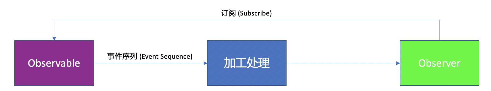

[TOC]


# 编程范式: 响应式编程 (Reactive Programming)


响应式编程 (Reactive Programming)，简称 RP，是一种编程范式，可以简化异步编程，提供更优雅的数据绑定，并且[函数式编程](编程范式:%20函数式编程%20(Functional%20Programming).md)的编程思想也会应用其中，所以也有一种叫法 - 函数响应式编程 (Functional Reactive Programming - FRP)

Swift相关的主流响应式框架主要有：

1. ReactiveCocoa (RAC)

   主要有Objective-C和Swift版本，[官网](https://reactivecocoa.io) & [GitHub](https://github.com/ReactiveCocoa)

2. [RxSwift](https://github.com/ReactiveX/RxSwift)

   隶属于[ReactiveX](https://github.com/ReactiveX) (*支持[众多编程语言](http://reactivex.io/languages.html)*)

目前，项目中用的比较多的应该是RxSwift，关于如何使用，可以查看[官方README文档](https://github.com/ReactiveX/RxSwift)，或者看这个[RxSwift 中文文档](https://beeth0ven.github.io/RxSwift-Chinese-Documentation/)


## RxSwift核心概念

RxSwift主要有 2 大角色：



1. Observable

   负责发送事件 (Event)

2. Observer

   负责订阅Observable，监听Observable发送的事件 (Event)

Event 的定义如下：

- next: 携带具体的数据
- error: 携带错误信息，表明Observable会终止，不会再发出事件
- completed: 表明Observable会终止，不会再发出事件

```swift
/// Represents a sequence event.
///
/// Sequence grammar: 
/// **next\* (error | completed)**
public enum Event<Element> {

    /// Next element is produced.
    case next(Element)

    /// Sequence terminated with an error.
    case error(Error)

    /// Sequence completed successfully.
    case completed
}
```


## 举例

示例代码：[HelloRx](../../Source/ReactiveProgramming/HelloRx)

